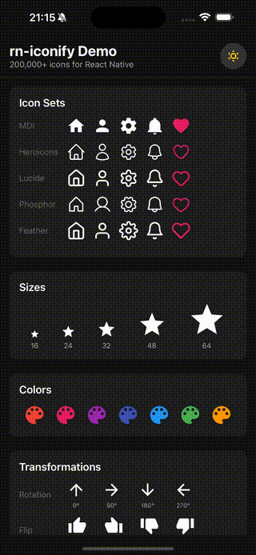

# rn-iconify

[](https://www.npmjs.com/package/rn-iconify)
[](https://github.com/mogretici/rn-iconify/blob/main/LICENSE)
[](https://www.typescriptlang.org/)
[](https://reactnative.dev/)

> **268,000+ icons** for React Native with native MMKV caching and full TypeScript autocomplete

Use **Material Design Icons**, **Heroicons**, **Lucide**, **Phosphor**, **Font Awesome**, **Feather**, **Tabler**, and **200+ more icon sets** in your React Native app with a simple, type-safe API.

<p align="center">
  
</p>

## Features

- **200+ Icon Sets** - Material Design, Heroicons, Lucide, Phosphor, Font Awesome, and 200+ more
- **268,000+ Icons** - Access the entire [Iconify](https://iconify.design) ecosystem
- **Simple Component API** - Clean `<Mdi name="home" />` syntax
- **Full TypeScript Autocomplete** - Per-component type safety without IDE slowdown
- **Build-time Bundling** - Babel plugin for 0ms first render (optional)
- **Native MMKV Caching** - 30x faster than AsyncStorage, persistent disk cache
- **TurboModule Support** - Native background prefetching for New Architecture
- **Offline Support** - Icons persist across app restarts

## Installation

```bash
npm install rn-iconify react-native-svg react-native-mmkv
```

### iOS

```bash
cd ios && pod install
```

### Expo

```bash
npx expo install rn-iconify react-native-svg react-native-mmkv
npx expo prebuild
```

> **Note:** rn-iconify requires a development build. It will not work with Expo Go.

## Quick Start

```tsx
import { Mdi, Heroicons, Lucide, Ph } from 'rn-iconify';

export default function App() {
  return (
    <>
      <Mdi name="home" size={24} color="blue" />
      <Heroicons name="user" size={24} color="red" />
      <Lucide name="camera" size={24} />
      <Ph name="house" size={24} color="#6366f1" />
    </>
  );
}
```

## Popular Icon Sets

| Component         | Prefix           | Icons  | Description             |
| ----------------- | ---------------- | ------ | ----------------------- |
| `Mdi`             | mdi              | 7,447  | Material Design Icons   |
| `Heroicons`       | heroicons        | 1,288  | Heroicons by Tailwind   |
| `Lucide`          | lucide           | 1,650  | Lucide Icons            |
| `Ph`              | ph               | 9,072  | Phosphor Icons          |
| `Feather`         | feather          | 286    | Feather Icons           |
| `Tabler`          | tabler           | 5,963  | Tabler Icons            |
| `Bi`              | bi               | 2,078  | Bootstrap Icons         |
| `Fa6Solid`        | fa6-solid        | 1,402  | Font Awesome 6 Solid    |
| `Fa7Solid`        | fa7-solid        | 1,983  | Font Awesome 7 Solid    |
| `Ri`              | ri               | 3,135  | Remix Icons             |
| `Carbon`          | carbon           | 2,392  | IBM Carbon Icons        |
| `Fluent`          | fluent           | 18,729 | Microsoft Fluent UI     |
| `MaterialSymbols` | material-symbols | 15,049 | Google Material Symbols |
| `Solar`           | solar            | 7,401  | Solar Icons             |
| `Ion`             | ion              | 1,357  | Ionicons                |
| `AntDesign`       | ant-design       | 830    | Ant Design Icons        |

...and **196 more icon sets**! Browse all at [icon-sets.iconify.design](https://icon-sets.iconify.design/)

## Props

| Prop                  | Type                                              | Default      | Description                        |
| --------------------- | ------------------------------------------------- | ------------ | ---------------------------------- |
| `name`                | `string`                                          | **required** | Icon name (with autocomplete)      |
| `size`                | `number`                                          | `24`         | Icon width and height              |
| `color`               | `string`                                          | `'#000000'`  | Icon color                         |
| `width`               | `number`                                          | -            | Custom width (overrides size)      |
| `height`              | `number`                                          | -            | Custom height (overrides size)     |
| `rotate`              | `0 \| 90 \| 180 \| 270`                           | `0`          | Rotation angle                     |
| `flip`                | `'horizontal' \| 'vertical' \| 'both'`            | -            | Flip direction                     |
| `style`               | `ViewStyle`                                       | -            | Additional styles                  |
| `placeholder`         | `'skeleton' \| 'pulse' \| 'shimmer' \| ReactNode` | -            | Loading placeholder                |
| `placeholderColor`    | `string`                                          | `'#E1E1E1'`  | Placeholder background color       |
| `placeholderDuration` | `number`                                          | `1000`       | Animation duration (ms)            |
| `fallback`            | `ReactNode`                                       | -            | Custom fallback (deprecated)       |
| `fallbackDelay`       | `number`                                          | `0`          | Delay before showing fallback (ms) |
| `onLoad`              | `() => void`                                      | -            | Called when icon loads             |
| `onError`             | `(error: Error) => void`                          | -            | Called on load failure             |
| `accessibilityLabel`  | `string`                                          | icon name    | Accessibility label                |
| `testID`              | `string`                                          | -            | Test identifier                    |

## TypeScript

Full autocomplete for all 268,000+ icons:

```tsx
import { Mdi, type MdiIconName } from 'rn-iconify';

interface TabBarIconProps {
  name: MdiIconName;
  focused: boolean;
}

function TabBarIcon({ name, focused }: TabBarIconProps) {
  return (
    <Mdi
      name={name} // Full autocomplete!
      size={24}
      color={focused ? 'blue' : 'gray'}
    />
  );
}

<TabBarIcon name="home" focused />     // Valid
<TabBarIcon name="invalid" focused />  // TypeScript error
```

## Prefetching

Preload icons for instant rendering:

```tsx
import { prefetchIcons } from 'rn-iconify';

async function initApp() {
  const result = await prefetchIcons(['mdi:home', 'mdi:settings', 'heroicons:user']);
  console.log(`Prefetched: ${result.success.length}`);
}
```

## Build-time Bundling (Babel Plugin)

For **0ms first render**, use the Babel plugin to automatically bundle icons at build time:

```js
// babel.config.js
module.exports = {
  presets: ['module:@react-native/babel-preset'],
  plugins: ['rn-iconify/babel'],
};
```

That's it! The plugin automatically:

1. Scans your code during Metro build
2. Detects all icon usage (`<Mdi name="home" />`, `prefetchIcons([...])`)
3. Fetches icons from Iconify API at build time
4. Bundles them into your app for instant rendering

### Plugin Options

```js
// babel.config.js
module.exports = {
  presets: ['module:@react-native/babel-preset'],
  plugins: [
    [
      'rn-iconify/babel',
      {
        // Only bundle specific icon sets
        include: ['mdi:*', 'heroicons:*'],

        // Exclude test icons
        exclude: ['mdi:test-*'],

        // Custom output directory
        outputPath: '.rn-iconify-cache',

        // Enable verbose logging
        verbose: true,
      },
    ],
  ],
};
```

| Option       | Type       | Default             | Description                |
| ------------ | ---------- | ------------------- | -------------------------- |
| `include`    | `string[]` | -                   | Only bundle matching icons |
| `exclude`    | `string[]` | -                   | Exclude matching icons     |
| `outputPath` | `string`   | `.rn-iconify-cache` | Cache directory            |
| `verbose`    | `boolean`  | `false`             | Enable build-time logging  |
| `disabled`   | `boolean`  | `false`             | Disable the plugin         |

### How It Works

```
┌─────────────────────────────────────────────────────────────┐
│ Build Time (Metro)                                          │
├─────────────────────────────────────────────────────────────┤
│ 1. Babel plugin scans JSX: <Mdi name="home" />              │
│ 2. Collects icon names: mdi:home, heroicons:user, ...       │
│ 3. Fetches from Iconify API                                 │
│ 4. Writes to .rn-iconify-cache/icons.json                   │
└─────────────────────────────────────────────────────────────┘
                            ↓
┌─────────────────────────────────────────────────────────────┐
│ Runtime                                                     │
├─────────────────────────────────────────────────────────────┤
│ 1. CacheManager loads bundled icons (instant)               │
│ 2. Icons render with 0ms delay                              │
│ 3. Dynamic icons still fetched from network (fallback)      │
└─────────────────────────────────────────────────────────────┘
```

### Usage Tiers

| Tier           | Setup              | First Render | Best For                 |
| -------------- | ------------------ | ------------ | ------------------------ |
| **Basic**      | None               | ~100-500ms   | Simple apps, development |
| **Optimized**  | Add Babel plugin   | **0ms**      | Production apps          |
| **Enterprise** | CLI bundle command | **0ms**      | CI/CD, custom pipelines  |

## Cache Management

```tsx
import { getCacheStats, clearCache } from 'rn-iconify';

// Get statistics
const stats = getCacheStats();
console.log(`Memory: ${stats.memoryCount}, Bundled: ${stats.bundledCount}`);
console.log(`Disk: ${stats.diskCount}, Size: ${(stats.diskSizeBytes / 1024).toFixed(1)} KB`);

// Clear all caches
await clearCache();
```

## Examples

```tsx
// Basic
<Mdi name="home" size={24} color="blue" />

// Rotation
<Mdi name="arrow-right" rotate={90} />

// Flip
<Mdi name="arrow-left" flip="horizontal" />

// Loading placeholder
<Mdi
  name="home"
  placeholder="shimmer"
  onLoad={() => console.log('Loaded!')}
/>
```

## Placeholders

Show animated placeholders while icons load:

```tsx
// Built-in presets
<Mdi name="home" placeholder="skeleton" />  // Static gray box
<Mdi name="home" placeholder="pulse" />     // Fading opacity
<Mdi name="home" placeholder="shimmer" />   // Animated gradient

// Custom styling
<Mdi
  name="home"
  placeholder="shimmer"
  placeholderColor="#E0E0E0"
  placeholderDuration={1500}
/>

// Custom component
<Mdi
  name="home"
  placeholder={<ActivityIndicator size="small" />}
/>
```

| Preset     | Description                              |
| ---------- | ---------------------------------------- |
| `skeleton` | Static gray box (no animation)           |
| `pulse`    | Fading opacity animation                 |
| `shimmer`  | Animated gradient sweep (most prominent) |

## Theme Provider

Set global defaults for all icons with `IconThemeProvider`:

```tsx
import { IconThemeProvider, Mdi, Heroicons } from 'rn-iconify';

export default function App() {
  return (
    <IconThemeProvider
      theme={{
        size: 28,
        color: '#333333',
        placeholder: 'shimmer',
        placeholderColor: '#E0E0E0',
      }}
    >
      <YourApp />
    </IconThemeProvider>
  );
}

// All icons inherit theme defaults
<Mdi name="home" />           // size=28, color=#333333
<Heroicons name="user" />     // size=28, color=#333333
<Mdi name="star" color="gold" />  // size=28, color=gold (override)
```

### Theme Properties

| Property              | Type                                   | Default     | Description                 |
| --------------------- | -------------------------------------- | ----------- | --------------------------- |
| `size`                | `number`                               | `24`        | Default icon size           |
| `color`               | `string`                               | `'#000000'` | Default icon color          |
| `placeholder`         | `PlaceholderType`                      | -           | Default placeholder         |
| `placeholderColor`    | `string`                               | `'#E1E1E1'` | Default placeholder color   |
| `placeholderDuration` | `number`                               | `1000`      | Default animation duration  |
| `rotate`              | `0 \| 90 \| 180 \| 270`                | `0`         | Default rotation            |
| `flip`                | `'horizontal' \| 'vertical' \| 'both'` | -           | Default flip direction      |
| `fallbackDelay`       | `number`                               | `0`         | Default fallback delay (ms) |

### useIconTheme Hook

Access and modify theme from any component:

```tsx
import { useIconTheme } from 'rn-iconify';

function ThemeToggle() {
  const { theme, setTheme } = useIconTheme();

  const toggleDarkMode = () => {
    setTheme((prev) => ({
      ...prev,
      color: prev.color === '#000000' ? '#ffffff' : '#000000',
    }));
  };

  return <Button onPress={toggleDarkMode} title="Toggle Theme" />;
}
```

### Nested Themes

Inner providers override outer providers:

```tsx
<IconThemeProvider theme={{ size: 24, color: 'blue' }}>
  <Mdi name="home" /> {/* blue, 24px */}
  <IconThemeProvider theme={{ size: 32, color: 'red' }}>
    <Mdi name="star" /> {/* red, 32px */}
  </IconThemeProvider>
</IconThemeProvider>
```

## Icon Aliases

Create custom icon name mappings for consistent usage across your app:

### Basic Usage with Generic Icon

```tsx
import { Icon, IconAliasProvider } from 'rn-iconify';

const aliases = {
  back: 'mdi:arrow-left',
  forward: 'mdi:arrow-right',
  menu: 'heroicons:bars-3',
  close: 'mdi:close',
};

function App() {
  return (
    <IconAliasProvider aliases={aliases}>
      <Icon name="back" size={24} /> {/* Renders mdi:arrow-left */}
      <Icon name="menu" color="blue" /> {/* Renders heroicons:bars-3 */}
      <Icon name="mdi:home" size={32} /> {/* Full names still work */}
    </IconAliasProvider>
  );
}
```

### Type-Safe Aliases with createIconAliases

For full TypeScript autocomplete, use `createIconAliases`:

```tsx
// icons.ts
import { createIconAliases } from 'rn-iconify';

export const {
  Icon,
  Provider: IconProvider,
  aliases,
} = createIconAliases({
  aliases: {
    back: 'mdi:arrow-left',
    forward: 'mdi:arrow-right',
    menu: 'heroicons:bars-3',
    close: 'mdi:close',
    home: 'mdi:home',
    settings: 'lucide:settings',
    user: 'heroicons:user',
  } as const, // 'as const' is important for TypeScript inference
});

// App.tsx
import { Icon, IconProvider } from './icons';

function App() {
  return (
    <IconProvider>
      <Icon name="back" size={24} /> {/* Full autocomplete! */}
      <Icon name="home" color="blue" />
      <Icon name="invalid" /> {/* TypeScript error! */}
    </IconProvider>
  );
}
```

### With React Navigation

```tsx
import { Icon } from './icons';

<Tab.Navigator>
  <Tab.Screen
    name="Home"
    component={HomeScreen}
    options={{
      tabBarIcon: ({ color, size }) => <Icon name="home" color={color} size={size} />,
    }}
  />
  <Tab.Screen
    name="Settings"
    component={SettingsScreen}
    options={{
      tabBarIcon: ({ color, size }) => <Icon name="settings" color={color} size={size} />,
    }}
  />
</Tab.Navigator>;
```

### Nesting Providers

Child providers extend parent aliases by default:

```tsx
<IconAliasProvider aliases={{ back: 'mdi:arrow-left' }}>
  <Icon name="back" /> {/* Works */}
  <IconAliasProvider aliases={{ menu: 'heroicons:bars-3' }}>
    <Icon name="back" /> {/* Still works - inherited */}
    <Icon name="menu" /> {/* Also works */}
  </IconAliasProvider>
</IconAliasProvider>
```

Set `extend={false}` to isolate aliases:

```tsx
<IconAliasProvider aliases={{ back: 'mdi:arrow-left' }}>
  <IconAliasProvider aliases={{ menu: 'heroicons:bars-3' }} extend={false}>
    <Icon name="back" /> {/* Warning: unknown alias */}
    <Icon name="menu" /> {/* Works */}
  </IconAliasProvider>
</IconAliasProvider>
```

### Benefits

- **Consistency**: Use the same icon names throughout your app
- **Easy Migration**: Change icons in one place
- **TypeScript**: Full autocomplete with `createIconAliases`
- **Flexibility**: Full icon names (`mdi:home`) still work alongside aliases

## React Navigation Integration

Helpers for seamless integration with React Navigation:

### Tab Bar Icons

```tsx
import { createTabBarIcon } from 'rn-iconify/navigation';

<Tab.Navigator>
  <Tab.Screen
    name="Home"
    component={HomeScreen}
    options={{
      tabBarIcon: createTabBarIcon(['mdi:home', 'mdi:home-outline']),
    }}
  />
  <Tab.Screen
    name="Settings"
    component={SettingsScreen}
    options={{
      tabBarIcon: createTabBarIcon({
        focused: 'mdi:cog',
        unfocused: 'mdi:cog-outline',
        size: 26,
        focusedColor: '#007AFF',
      }),
    }}
  />
</Tab.Navigator>;
```

### Quick Tab Icon Helper

```tsx
import { tabIcon } from 'rn-iconify/navigation';

// Automatically uses {prefix}:{name} for focused and {prefix}:{name}-outline for unfocused
<Tab.Screen
  options={{
    tabBarIcon: tabIcon('mdi', 'home'), // mdi:home / mdi:home-outline
  }}
/>;
```

### Batch Creation

```tsx
import { createTabBarIcons } from 'rn-iconify/navigation';

const tabIcons = createTabBarIcons({
  Home: ['mdi:home', 'mdi:home-outline'],
  Search: 'mdi:magnify',
  Profile: { focused: 'mdi:account', unfocused: 'mdi:account-outline' },
});

<Tab.Screen name="Home" options={{ tabBarIcon: tabIcons.Home }} />;
```

### Drawer Icons

```tsx
import { createDrawerIcon, createDrawerIcons } from 'rn-iconify/navigation';

<Drawer.Screen
  name="Home"
  options={{
    drawerIcon: createDrawerIcon('mdi:home'),
  }}
/>

// Or with focused state
<Drawer.Screen
  options={{
    drawerIcon: createDrawerIcon({
      icon: 'mdi:home-outline',
      focusedIcon: 'mdi:home',
    }),
  }}
/>
```

### Header Icons

```tsx
import {
  createHeaderIcon,
  createBackIcon,
  createCloseIcon,
  createMenuIcon,
} from 'rn-iconify/navigation';

<Stack.Navigator>
  <Stack.Screen
    name="Details"
    options={({ navigation }) => ({
      headerLeft: createBackIcon({ onPress: () => navigation.goBack() }),
      headerRight: createHeaderIcon({
        icon: 'mdi:dots-vertical',
        onPress: () => showMenu(),
      }),
    })}
  />
</Stack.Navigator>

// Modal with close button
<Stack.Screen
  name="Modal"
  options={({ navigation }) => ({
    headerRight: createCloseIcon({ onPress: () => navigation.goBack() }),
  })}
/>

// Drawer menu button
<Stack.Screen
  options={({ navigation }) => ({
    headerLeft: createMenuIcon({ onPress: () => navigation.openDrawer() }),
  })}
/>
```

### useNavigationIcon Hook

For dynamic icon creation in functional components:

```tsx
import { useNavigationIcon } from 'rn-iconify/navigation';

function MyTabs() {
  const { tabBarIcon, drawerIcon, autoTabBarIcon } = useNavigationIcon();

  return (
    <Tab.Navigator>
      <Tab.Screen
        name="Home"
        options={{
          tabBarIcon: tabBarIcon('mdi:home', 'mdi:home-outline'),
        }}
      />
      <Tab.Screen
        name="Profile"
        options={{
          tabBarIcon: autoTabBarIcon('mdi', 'account'), // Auto outline
        }}
      />
    </Tab.Navigator>
  );
}
```

### Navigation Helper Options

| Function            | Input                                      | Description                      |
| ------------------- | ------------------------------------------ | -------------------------------- |
| `createTabBarIcon`  | `string \| [focused, unfocused] \| config` | Create tab bar icon function     |
| `createTabBarIcons` | `{ name: config }`                         | Batch create tab icons           |
| `tabIcon`           | `(prefix, name, suffix?)`                  | Auto-outline tab icon            |
| `createDrawerIcon`  | `string \| config`                         | Create drawer icon function      |
| `createDrawerIcons` | `{ name: config }`                         | Batch create drawer icons        |
| `createHeaderIcon`  | `config`                                   | Create header icon component     |
| `createBackIcon`    | `options?`                                 | Back arrow icon (mdi:arrow-left) |
| `createCloseIcon`   | `options?`                                 | Close icon (mdi:close)           |
| `createMenuIcon`    | `options?`                                 | Menu icon (mdi:menu)             |
| `useNavigationIcon` | `options?`                                 | Hook for dynamic icons           |

## Animated Icons

Add animations to your icons using the `AnimatedIcon` wrapper component:

### Basic Usage

```tsx
import { AnimatedIcon } from 'rn-iconify/animated';
import { Mdi } from 'rn-iconify';

// Loading spinner
<AnimatedIcon animate="spin">
  <Mdi name="loading" size={24} />
</AnimatedIcon>

// Pulsing heartbeat
<AnimatedIcon animate="pulse">
  <Mdi name="heart" size={24} color="red" />
</AnimatedIcon>

// Bouncing attention grabber
<AnimatedIcon animate="bounce">
  <Mdi name="bell" size={24} />
</AnimatedIcon>

// Error shake
<AnimatedIcon animate="shake">
  <Mdi name="alert" size={24} />
</AnimatedIcon>

// Notification ping
<AnimatedIcon animate="ping">
  <Mdi name="circle" size={24} />
</AnimatedIcon>

// Playful wiggle
<AnimatedIcon animate="wiggle">
  <Mdi name="hand-wave" size={24} />
</AnimatedIcon>
```

### Custom Animation Configuration

```tsx
import { AnimatedIcon } from 'rn-iconify/animated';
import { Mdi } from 'rn-iconify';

<AnimatedIcon
  animate={{
    type: 'rotate',
    duration: 2000,
    easing: 'linear',
    loop: true,
  }}
>
  <Mdi name="sync" size={24} />
</AnimatedIcon>

<AnimatedIcon
  animate={{
    type: 'scale',
    duration: 800,
    from: 1,
    to: 1.3,
    easing: 'ease-in-out',
  }}
>
  <Mdi name="star" size={24} />
</AnimatedIcon>
```

### AnimatedIcon Props

| Prop                  | Type                                 | Default | Description             |
| --------------------- | ------------------------------------ | ------- | ----------------------- |
| `animate`             | `AnimationPreset \| AnimationConfig` | -       | Animation to apply      |
| `animationDuration`   | `number`                             | varies  | Duration override (ms)  |
| `animationLoop`       | `boolean`                            | varies  | Loop override           |
| `animationEasing`     | `AnimationEasing`                    | varies  | Easing override         |
| `animationDelay`      | `number`                             | `0`     | Delay before start (ms) |
| `autoPlay`            | `boolean`                            | `true`  | Auto-start animation    |
| `onAnimationComplete` | `() => void`                         | -       | Callback on completion  |

### Animation Presets

| Preset   | Type          | Duration | Loops | Description      |
| -------- | ------------- | -------- | ----- | ---------------- |
| `spin`   | rotate        | 1000ms   | Yes   | 360° rotation    |
| `pulse`  | scale         | 1500ms   | Yes   | Scale 1→1.2      |
| `bounce` | translate     | 600ms    | Yes   | Vertical bounce  |
| `shake`  | translate     | 500ms    | No    | Horizontal shake |
| `ping`   | scale+opacity | 1000ms   | Yes   | Expand + fade    |
| `wiggle` | rotate        | 300ms    | No    | ±15° rotation    |

### Animation Control with Ref

Use ref for manual animation control:

```tsx
import { useRef } from 'react';
import { AnimatedIcon } from 'rn-iconify/animated';
import { Mdi } from 'rn-iconify';
import type { AnimationControls } from 'rn-iconify/animated';

const animRef = useRef<AnimationControls>(null);

<AnimatedIcon ref={animRef} animate="bounce" autoPlay={false}>
  <Mdi name="heart" size={24} />
</AnimatedIcon>;

// Control animation
animRef.current?.start();
animRef.current?.stop();
animRef.current?.reset();
```

### useIconAnimation Hook

Create custom animated components:

```tsx
import { useIconAnimation } from 'rn-iconify/animated';
import { Animated, TouchableOpacity } from 'react-native';
import { Mdi } from 'rn-iconify';

function CustomAnimatedIcon() {
  const { animatedStyle, start, stop, isAnimating } = useIconAnimation({
    animation: 'spin',
    autoPlay: false,
  });

  return (
    <TouchableOpacity onPress={isAnimating ? stop : start}>
      <Animated.View style={animatedStyle}>
        <Mdi name="refresh" size={24} />
      </Animated.View>
    </TouchableOpacity>
  );
}
```

## Custom Icon Server

Configure rn-iconify to use your own self-hosted Iconify server:

```tsx
import { configure } from 'rn-iconify';

// Basic custom server
configure({
  api: {
    apiUrl: 'https://icons.mycompany.com',
    timeout: 10000,
  },
});

// With authentication
configure({
  api: {
    apiUrl: 'https://api.mycompany.com/icons',
    headers: {
      Authorization: 'Bearer your-token',
      'X-API-Key': 'your-api-key',
    },
  },
});

// Full configuration
configure({
  api: {
    apiUrl: 'https://icons.mycompany.com',
    timeout: 30000,
    retries: 3,
    retryDelay: 2000,
    logging: true, // Enable request logging
  },
  cache: {
    maxMemoryItems: 1000,
    enableDiskCache: true,
  },
  performance: {
    enabled: true,
    maxHistorySize: 500,
  },
});
```

### Configuration Options

| Category      | Option            | Type      | Default                        | Description                |
| ------------- | ----------------- | --------- | ------------------------------ | -------------------------- |
| `api`         | `apiUrl`          | `string`  | `'https://api.iconify.design'` | API base URL               |
|               | `timeout`         | `number`  | `30000`                        | Request timeout (ms)       |
|               | `retries`         | `number`  | `2`                            | Retry attempts             |
|               | `retryDelay`      | `number`  | `1000`                         | Delay between retries (ms) |
|               | `headers`         | `object`  | `{}`                           | Custom request headers     |
|               | `logging`         | `boolean` | `false`                        | Enable request logging     |
| `cache`       | `maxMemoryItems`  | `number`  | `500`                          | Max icons in memory        |
|               | `enableDiskCache` | `boolean` | `true`                         | Enable MMKV caching        |
| `performance` | `enabled`         | `boolean` | `false`                        | Enable monitoring          |
|               | `maxHistorySize`  | `number`  | `1000`                         | Max event history          |

## Performance Monitoring

Track and analyze icon loading performance:

```tsx
import {
  enablePerformanceMonitoring,
  disablePerformanceMonitoring,
  getPerformanceReport,
  printPerformanceReport,
  PerformanceMonitor,
} from 'rn-iconify';

// Enable monitoring
enablePerformanceMonitoring();

// Later, get the report
const report = getPerformanceReport();
console.log(`Cache hit rate: ${(report.cacheStats.hitRate * 100).toFixed(1)}%`);
console.log(`Avg load time: ${report.summary.avgLoadTime.toFixed(2)}ms`);

// Print formatted report to console
printPerformanceReport();
```

### Performance Report Contents

```tsx
interface PerformanceReport {
  summary: {
    avgLoadTime: number; // Average load time (ms)
    minLoadTime: number; // Fastest load
    maxLoadTime: number; // Slowest load
    p50LoadTime: number; // Median
    p90LoadTime: number; // 90th percentile
    p99LoadTime: number; // 99th percentile
    totalLoads: number; // Total icons loaded
    totalErrors: number; // Error count
    uptime: number; // Time since monitoring started
  };
  cacheStats: {
    memoryHits: number; // Memory cache hits
    bundledHits: number; // Bundled icon hits
    diskHits: number; // MMKV cache hits
    networkFetches: number; // Network requests
    hitRate: number; // Cache hit rate (0-1)
  };
  loadTimesByType: {
    memory: number; // Avg memory load time
    bundled: number; // Avg bundled load time
    disk: number; // Avg disk load time
    network: number; // Avg network load time
  };
  slowestIcons: Array<{ iconName; avgDuration; count }>;
  mostUsedIcons: Array<{ iconName; count }>;
}
```

### Subscribe to Events

```tsx
const unsubscribe = PerformanceMonitor.subscribe((event) => {
  console.log(`${event.iconName}: ${event.type} in ${event.duration}ms`);
});

// Later
unsubscribe();
```

## Accessibility

Provide accessible icons with auto-generated labels, high contrast support, and reduced motion preferences:

```tsx
import { AccessibilityProvider, useAccessibleIcon } from 'rn-iconify';

// Wrap your app
function App() {
  return (
    <AccessibilityProvider
      config={{
        autoLabels: true,
        highContrast: false,
        respectReducedMotion: true,
        minTouchTargetSize: 44,
      }}
    >
      <MyApp />
    </AccessibilityProvider>
  );
}
```

### useAccessibleIcon Hook

Create accessible icon props automatically:

```tsx
import { useAccessibleIcon } from 'rn-iconify';

function MyIcon({ name, size, color }) {
  const { accessibilityProps, adjustedColor, touchTargetPadding, shouldDisableAnimations } =
    useAccessibleIcon({
      iconName: name,
      size,
      color,
      isInteractive: true,
    });

  return (
    <View style={{ padding: touchTargetPadding }} {...accessibilityProps}>
      <Mdi name={name} size={size} color={adjustedColor} />
    </View>
  );
}
```

### Accessibility Features

| Feature            | Description                                                                      |
| ------------------ | -------------------------------------------------------------------------------- |
| **Auto Labels**    | Generates readable labels from icon names (`mdi:arrow-left` → "arrow left icon") |
| **High Contrast**  | Adjusts colors for better visibility                                             |
| **Reduced Motion** | Disables animations when user prefers reduced motion                             |
| **Touch Targets**  | Calculates padding to meet 44px minimum touch target                             |
| **Screen Reader**  | Proper `accessibilityRole` and `accessibilityLabel`                              |

### Accessibility Configuration

| Option                 | Type                | Default   | Description                        |
| ---------------------- | ------------------- | --------- | ---------------------------------- |
| `autoLabels`           | `boolean`           | `true`    | Auto-generate accessibility labels |
| `labelGenerator`       | `function`          | built-in  | Custom label generator             |
| `highContrast`         | `boolean`           | `false`   | Enable high contrast mode          |
| `respectReducedMotion` | `boolean`           | `true`    | Disable animations when preferred  |
| `defaultRole`          | `AccessibilityRole` | `'image'` | Default a11y role                  |
| `minTouchTargetSize`   | `number`            | `44`      | Minimum touch target (px)          |

### Utility Functions

```tsx
import {
  defaultLabelGenerator,
  adjustForHighContrast,
  meetsContrastRequirement,
  getHighContrastAlternative,
  calculateTouchTargetPadding,
} from 'rn-iconify';

// Generate label from icon name
defaultLabelGenerator('mdi:arrow-left'); // "arrow left icon"

// Adjust color for high contrast
adjustForHighContrast('#CCCCCC'); // "#000000"

// Check WCAG contrast
meetsContrastRequirement('#000000', '#FFFFFF', 'AA'); // true

// Get high contrast alternative
getHighContrastAlternative('#666666', '#FFFFFF'); // "#000000"

// Calculate touch target padding
calculateTouchTargetPadding(24, 44); // 10
```

## Icon Explorer (Dev Mode)

Interactive development tool for exploring and testing icons:

```tsx
import { IconExplorer } from 'rn-iconify';

// Only render in development
function DevTools() {
  const [showExplorer, setShowExplorer] = useState(false);

  if (!__DEV__) return null;

  return (
    <>
      <Button title="Open Icon Explorer" onPress={() => setShowExplorer(true)} />
      <IconExplorer
        visible={showExplorer}
        onClose={() => setShowExplorer(false)}
        onIconSelect={(name) => console.log('Selected:', name)}
        onCopyCode={(code) => console.log('Copied:', code)}
      />
    </>
  );
}
```

### Explorer Features

- **Search Icons** - Search across all icon sets
- **Filter by Set** - Filter by specific icon sets (mdi, heroicons, etc.)
- **Preview Sizes** - Preview at different sizes (16, 24, 32, 48, 64)
- **Preview Colors** - Preview with different colors
- **Code Generation** - Copy JSX code to clipboard
- **Import Statement** - Copy import statement with code

### Explorer Props

| Prop           | Type       | Default | Description            |
| -------------- | ---------- | ------- | ---------------------- |
| `visible`      | `boolean`  | `true`  | Show/hide explorer     |
| `onClose`      | `function` | -       | Close callback         |
| `onIconSelect` | `function` | -       | Icon select callback   |
| `onCopyCode`   | `function` | -       | Code copy callback     |
| `iconSets`     | `string[]` | all     | Limit to specific sets |
| `maxResults`   | `number`   | `100`   | Max search results     |
| `initialQuery` | `string`   | `''`    | Initial search query   |

### Icon Set Utilities

```tsx
import {
  getAllIconSets,
  getIconSetByPrefix,
  getIconSetsByCategory,
  searchIconSets,
  generateImportStatement,
  generateIconJSX,
} from 'rn-iconify';

// Get all icon sets
const sets = getAllIconSets();

// Find by prefix
const mdi = getIconSetByPrefix('mdi');

// Filter by category
const brandIcons = getIconSetsByCategory('brand');

// Search icon sets
const results = searchIconSets('material');

// Generate code
generateImportStatement('mdi:home');
// "import { Mdi } from 'rn-iconify';"

generateIconJSX('mdi:home', 24, '#FF0000');
// '<Mdi name="home" size={24} color="#FF0000" />'
```

## CLI Tools

### Bundle Generator

Create an offline icon bundle for instant rendering without network requests:

```bash
# Auto-detect icons from source code
npx rn-iconify bundle --auto --output ./assets/icons.bundle.json

# Manual icon list
npx rn-iconify bundle --icons "mdi:home,mdi:settings,heroicons:user"

# With verbose output
npx rn-iconify bundle --auto --verbose --pretty
```

Load the bundle in your app:

```tsx
import { loadOfflineBundle } from 'rn-iconify';
import iconBundle from './assets/icons.bundle.json';

// Load on app start (synchronous)
const res = loadOfflineBundle(iconBundle);
console.log(`Loaded ${res.loaded} icons in ${res.loadTimeMs}ms`);

// Or async for large bundles
const result = await loadOfflineBundleAsync(iconBundle, {
  batchSize: 100,
  onProgress: (loaded, total) => console.log(`${loaded}/${total}`),
});
```

### Analyzer

Analyze icon usage in your codebase:

```bash
# Table format (default)
npx rn-iconify analyze --src ./src

# JSON output
npx rn-iconify analyze --format json

# Markdown with file locations
npx rn-iconify analyze --format markdown --detailed
```

Example output:

```
┌───────────────────────────────────────────────────────┐
│ 📊 Icon Usage Report                                  │
├───────────────────────────────────────────────────────┤
│ Total icons: 47     │ Est. size: 12.3 KB │ Files: 23 │
├───────────────────────────────────────────────────────┤
│ Prefix          │ Count  │ Icons  │ % Total   │
├───────────────────────────────────────────────────────┤
│ mdi             │ 89     │ 23     │ 50.4%     │
│ heroicons       │ 52     │ 15     │ 33.3%     │
│ lucide          │ 25     │ 9      │ 16.3%     │
└───────────────────────────────────────────────────────┘

🔥 Top 10 Most Used Icons:
   1. mdi:home (12x)
   2. mdi:settings (8x)
   3. heroicons:user (7x)
```

### CLI Options

| Command   | Option       | Description                                         |
| --------- | ------------ | --------------------------------------------------- |
| `bundle`  | `--src`      | Source directory (default: `./src`)                 |
|           | `--output`   | Output file (default: `./assets/icons.bundle.json`) |
|           | `--auto`     | Auto-detect from source (default: true)             |
|           | `--icons`    | Comma-separated icon list                           |
|           | `--exclude`  | Patterns to exclude                                 |
|           | `--verbose`  | Show detailed output                                |
|           | `--pretty`   | Pretty-print JSON                                   |
| `analyze` | `--src`      | Source directory (default: `./src`)                 |
|           | `--format`   | Output: `table`, `json`, `markdown`                 |
|           | `--detailed` | Show file locations                                 |
|           | `--verbose`  | Show detailed output                                |

## Architecture

### Cache Layers

Icons flow through a 4-tier caching system:

```
┌─────────────┐     ┌─────────────┐     ┌─────────────┐     ┌─────────────┐
│   Memory    │ --> │  Bundled    │ --> │  MMKV Disk  │ --> │   Network   │
│   Cache     │     │   Icons     │     │    Cache    │     │  (Iconify)  │
│   < 1ms     │     │   < 1ms     │     │   < 5ms     │     │  100-500ms  │
└─────────────┘     └─────────────┘     └─────────────┘     └─────────────┘
```

1. **Memory Cache** - Instant access via LRU Map
2. **Bundled Icons** - Build-time bundled icons (with Babel plugin)
3. **MMKV Disk Cache** - JSI-based synchronous storage, survives app restarts
4. **Network** - Fetches from Iconify JSON API with retry logic

### Network Features

- **30s request timeout** with automatic retry (2 attempts)
- **Request deduplication** prevents duplicate network calls
- **AbortController** support for cancellation
- **Batch fetching** with alphabetically sorted icons (Iconify best practice)
- **Partial failure handling** - individual icon failures don't block others

### Native Modules (iOS/Android)

- Background prefetching with native threading
- Consistent JSON API usage across all platforms
- Thread-safe cache statistics
- Proper resource cleanup on module invalidation

## Performance

| Metric             | Value     |
| ------------------ | --------- |
| Memory cache       | < 1ms     |
| MMKV disk cache    | < 5ms     |
| Network fetch      | 100-500ms |
| Bundle size (core) | ~50KB     |

## Compatibility

| Platform                | Version |
| ----------------------- | ------- |
| React Native            | 0.60.0+ |
| React Native (New Arch) | 0.72.0+ |
| iOS                     | 13.0+   |
| Android                 | API 21+ |

## Contributing

```bash
git clone https://github.com/mogretici/rn-iconify.git
npm install
npm test
npm run build
npm run generate-components  # Regenerate from Iconify API
```

## Credits

- [Iconify](https://iconify.design/) - Icon framework
- [react-native-svg](https://github.com/software-mansion/react-native-svg) - SVG rendering
- [react-native-mmkv](https://github.com/mrousavy/react-native-mmkv) - Fast storage

## License

MIT
